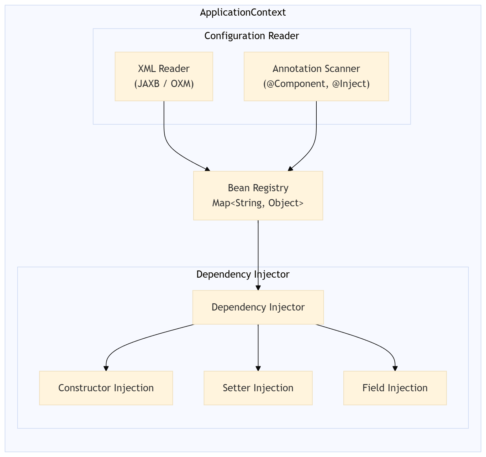
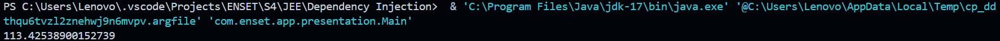
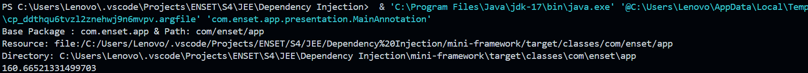

# Rapport de Travaux Pratiques : Injection des Dépendances

**Filière :** GLSID - Génie - Génie du Logiciel et des Systèmes Informatiques Distribués  
**Encadrant :** Mohamed YOUSSFI  
**Étudiant(e) :** Youness HATTABI

---

## Table des Matières

1. [Introduction](#1-introduction)
2. [Partie 1 — Mise en Œuvre de l'Injection des Dépendances](#2-partie-1--mise-en-œuvre-de-linjection-des-dépendances)
   - 2.1 [Création de l'interface `IDao`](#21-création-de-linterface-idao)
   - 2.2 [Implémentation de `IDao`](#22-implémentation-de-idao)
   - 2.3 [Création de l'interface `IMetier`](#23-création-de-linterface-imetier)
   - 2.4 [Implémentation de `IMetier` avec couplage faible](#24-implémentation-de-imetier-avec-couplage-faible)
   - 2.5 [Injection des dépendances](#25-injection-des-dépendances)
3. [Partie 2 — Mini-Framework d'Injection des Dépendances](#3-partie-2--mini-framework-dinjection-des-dépendances)
   - 3.1 [Architecture générale du framework](#31-architecture-générale-du-framework)
   - 3.2 [Injection via fichier XML (JAX Binding / OXM)](#32-injection-via-fichier-xml-jax-binding--oxm)
   - 3.3 [Injection via annotations](#33-injection-via-annotations)
   - 3.4 [Mécanismes d'injection](#34-mécanismes-dinjection)
4. [Tests et Résultats](#4-tests-et-résultats)

---

## 1. Introduction

L'injection des dépendances (_Dependency Injection_, DI) constitue l'un des principes fondamentaux de la conception logicielle moderne. Elle s'inscrit dans le cadre plus large de l'inversion de contrôle (_Inversion of Control_, IoC), un paradigme architectural qui délègue la gestion du cycle de vie des objets à un conteneur ou à un framework externe, plutôt qu'aux objets eux-mêmes.

Ce rapport présente les travaux réalisés en deux parties. La première partie s'attache à illustrer, par des exemples concrets en Java, les différentes modalités d'injection des dépendances — statique, dynamique, ainsi que via le framework Spring. La seconde partie décrit la conception et le développement d'un mini-framework d'injection des dépendances, s'inspirant du conteneur Spring IoC, et supportant deux modes de configuration : XML (via JAXB) et annotations.

---

## 2. Partie 1 — Mise en Œuvre de l'Injection des Dépendances

### 2.1 Création de l'interface `IDao`

L'interface `IDao` définit le contrat de la couche d'accès aux données. Elle expose une méthode `getData()` dont l'implémentation variera en fonction de la source de données ciblée (base de données, fichier, service distant, etc.)

```java
public interface IDao {
    public double getData();
}
```

---

### 2.2 Implémentation de `IDao`

Une implémentation concrète de l'interface `IDao` est fournie ci-dessous. Cette classe simule la récupération d'une donnée numérique depuis une source quelconque.

```java
public class DaoImpl implements IDao {
    @Override
    public double getData() {
        double temp = Math.random() * 40.;
        return temp;
    }
}
```

---

### 2.3 Création de l'interface `IMetier`

L'interface `IMetier` représente la couche métier de l'application. Elle expose une méthode `calcul()` qui s'appuie sur les données fournies par la couche d'accès aux données.

```java
public interface IMetier {
    public double calcul();
}
```

---

### 2.4 Implémentation de `IMetier` avec couplage faible

Afin de respecter le principe de **couplage faible**, la classe `MetierImpl` dépend de l'abstraction `IDao` et non d'une implémentation concrète. Cela permet de substituer facilement l'implémentation de la couche DAO sans modifier la couche métier.

```java
public class MetierImpl implements IMetier {

    private IDao dao;

    public double calcul() {
        double data = dao.getData();
        return data * 2;
    }

    public IDao getDao() {
        return dao;
    }

    public void setDao(IDao dao) {
        this.dao = dao;
    }

}
```

---

### 2.5 Injection des dépendances

#### 2.5.a — Instanciation statique

Dans cette approche, les dépendances sont injectées manuellement dans le code source de la classe principale (`main`). Bien que simple à mettre en œuvre, cette méthode souffre d'un couplage fort au niveau du programme principal.

```java
public class PresStatique {
    public static void main(String[] args) {
        DaoImpl dao = new DaoImpl();
        MetierImpl metier = new MetierImpl();
        metier.setDao(dao);
        System.out.println(metier.calcul());
    }
}
```

---

#### 2.5.b — Instanciation dynamique

L'instanciation dynamique exploite le mécanisme de **réflexion Java** (`java.lang.reflect`) pour instancier les classes et injecter les dépendances à partir d'un fichier de configuration externe (fichier `.txt`). Cette approche offre une flexibilité accrue, car il devient possible de modifier les implémentations utilisées sans recompiler l'application.

**Fichier de configuration (`config.txt`) :**

```
com.enset.dao.DaoImpl
com.enset.metier.MetierImpl
```

**Classe de présentation dynamique :**

```java
public class PresDynamique {
    public static void main(String[] args) {
        try (Scanner scanner = new Scanner(new File("config.txt"))) {

            String daoClassName = scanner.nextLine();
            String metierClassname = scanner.nextLine();

            Class<?> cDao = Class.forName(daoClassName);
            Class<?> cMetier = Class.forName(metierClassname);

            IDao dao = (IDao) cDao.getDeclaredConstructor().newInstance();
            IMetier metier = (IMetier) cMetier.getDeclaredConstructor().newInstance();

            Method method = cMetier.getMethod("setDao", IDao.class);
            method.invoke(metier, dao);

            System.out.println(metier.calcul());
        } catch (Exception e) {
            e.printStackTrace();
        }
    }
}
```

---

#### 2.5.c — Injection via le Framework Spring

##### Version XML

Spring IoC permet de déléguer la création et l'injection des objets (_beans_) à un conteneur configuré via un fichier XML.

**Fichier de configuration Spring (`applicationContext.xml`) :**

```xml
<?xml version="1.0" encoding="UTF-8"?>

<beans xmlns="http://www.springframework.org/schema/beans"
       xmlns:xsi="http://www.w3.org/2001/XMLSchema-instance"
       xsi:schemaLocation="
        http://www.springframework.org/schema/beans
        https://www.springframework.org/schema/beans/spring-beans.xsd">

    <bean id="dao" class="com.enset.dao.DaoImpl"/>

    <bean id="metier" class="com.enset.metier.MetierImpl">
        <property name="dao" ref="dao"/>
    </bean>

</beans>
```

**Classe principale Spring XML :**

```java
public class PresSpringXML {
    public static void main(String[] args) {
        ApplicationContext context = new ClassPathXmlApplicationContext("applicationContext.xml");
        IMetier metier = context.getBean("metier", IMetier.class);
        System.out.println(metier.calcul());
    }
}
```

---

##### Version Annotations

Spring propose également une approche déclarative via annotations, éliminant ainsi la nécessité d'un fichier XML verbeux.

**Classe DaoImpl modifiée :**

```java
@Component
public class DaoImpl implements IDao {
    @Override
    public double getData() {
        double temp = Math.random() * 40.;
        return temp;
    }
}
```

**Classe MetierImpl modifiée :**

```java
@Component
public class MetierImpl implements IMetier {

    @Autowired
    private IDao dao;

    public double calcul() {
        double data = dao.getData();
        return data * 2;
    }

    public IDao getDao() {
        return dao;
    }

    public void setDao(IDao dao) {
        this.dao = dao;
    }

}
```

**Classe principale Spring Annotations :**

```java
public class PresSpringAnnotation {
    public static void main(String[] args) {
        AnnotationConfigApplicationContext context = new AnnotationConfigApplicationContext("com.enset");
        IMetier metier = context.getBean(IMetier.class);
        System.out.println(metier.calcul());
    }
}
```

---

## 3. Partie 2 — Mini-Framework d'Injection des Dépendances

### 3.1 Architecture générale du framework

Le mini-framework développé dans cette partie s'inspire du conteneur Spring IoC. Il repose sur un conteneur léger capable de charger les configurations, d'instancier les beans et d'effectuer l'injection des dépendances selon trois mécanismes : constructeur, setter, et accès direct au champ (_field_).

**Diagramme de l'architecture générale :**



---

### 3.2 Injection via fichier XML (JAX Binding / OXM)

#### Modèle de configuration XML

Le framework utilise JAXB (_Java Architecture for XML Binding_) pour mapper le fichier XML de configuration vers des objets Java.

**Fichier de configuration (`config.xml`) :**

```xml
<beans>
    <bean id="dao" class="com.enset.app.dao.DaoImpl"/>
    <bean id="metier" class="com.enset.app.metier.MetierImpl">
        <property name="dao" ref="dao"/>
    </bean>
</beans>
```

**Classes de modèle JAXB :**

```java
@XmlRootElement(name = "beans")
@XmlAccessorType(XmlAccessType.FIELD)
public class Beans {

    @XmlElement(name = "bean")
    private List<BeanConfig> beans;

    public List<BeanConfig> getBeans() {
        return beans;
    }
}
```

**Classes de définition de Beans :**

```java
@XmlAccessorType(XmlAccessType.FIELD)
public class BeanConfig {

    @XmlAttribute
    private String id;

    @XmlAttribute(name = "class")
    private String className;

    @XmlElement(name = "property")
    private List<Property> properties;

    // Getters & Setters
}
```

**Classes de propriétés :**

```java
@XmlAccessorType(XmlAccessType.FIELD)
public class Property {

    @XmlAttribute
    private String name;

    @XmlAttribute
    private String ref;

    // Getters & Setters
}
```

#### Conteneur de base

```java
public interface ApplicationContext {
    Object getBean(String name);
}
```

#### Conteneur XML

```java
public class XmlApplicationContext implements ApplicationContext {

    private Map<String, Object> beans = new HashMap<>();

    public XmlApplicationContext(String configFile) {
        try {
            JAXBContext context = JAXBContext.newInstance(Beans.class);
            Beans config = (Beans) context.createUnmarshaller().unmarshal(new File(configFile));

            for (BeanConfig beanConfig : config.getBeans()) {
                Class<?> beanConfigClass = Class.forName(beanConfig.getClassName());
                Object instance;
                if (beanConfig.getConstructorArgs() != null
                        && !beanConfig.getConstructorArgs().isEmpty()) {
                    Object[] dependencies = beanConfig.getConstructorArgs().stream()
                            .map(arg -> beans.get(arg.getRef())).toArray();

                    Class<?>[] paramTypes = new Class[dependencies.length];
                    for (int i = 0; i < dependencies.length; i++) {
                        paramTypes[i] = dependencies[i].getClass().getInterfaces()[0];
                    }

                    instance = beanConfigClass.getConstructor(paramTypes).newInstance(dependencies);
                } else {
                    instance = beanConfigClass.getDeclaredConstructor().newInstance();
                }
                beans.put(beanConfig.getId(), instance);
            }

            for (BeanConfig beanConfig : config.getBeans()) {
                Object targetBean = beans.get(beanConfig.getId());
                if (beanConfig.getProperties() != null) {
                    for (Property property : beanConfig.getProperties()) {
                        Object dependency = beans.get(property.getRef());

                        try {
                            String setterName = "set" + property.getName().substring(0, 1).toUpperCase()
                                    + property.getName().substring(1);
                            Method setter = targetBean.getClass().getMethod(setterName,
                                    dependency.getClass().getInterfaces()[0]);
                            setter.invoke(targetBean, dependency);
                        } catch (NoSuchMethodException e) {
                            Field field = targetBean.getClass().getDeclaredField(property.getName());
                            field.setAccessible(true);
                            field.set(targetBean, dependency);
                        }
                    }
                }
            }
        } catch (Exception e) {
            e.printStackTrace();
        }
    }

    @Override
    public Object getBean(String name) {
        return beans.get(name);
    }
```

---

### 3.3 Injection via annotations

#### Définition des annotations personnalisées

```java
@Retention(RetentionPolicy.RUNTIME)
@Target(ElementType.TYPE)
public @interface Component {
    String value() default "";
}
```

```java
@Retention(RetentionPolicy.RUNTIME)
@Target({
        ElementType.FIELD,
        ElementType.CONSTRUCTOR,
        ElementType.METHOD
})
public @interface Inject {

}
```

#### Conteneur par annotations

```java
public class AnnotationApplicationContext implements ApplicationContext {
    private Map<String, Object> beans = new HashMap<>();

    /**
     * Initialise le contexte d'application en analysant le package spécifié
     * et en injectant les dépendances dans les beans découverts.
     *
     * @param basePackage le package racine à analyser
     */
    public AnnotationApplicationContext(String basePackage) {
        try {
            scanPackage(basePackage);
            injectDependencies();
        } catch (Exception e) {
            e.printStackTrace();
        }
    }

    /**
     * Récupère un bean enregistré par son nom.
     *
     * @param name le nom du bean à récupérer
     * @return l'objet bean correspondant, ou null s'il n'existe pas
     */
    @Override
    public Object getBean(String name) {
        return beans.get(name);
    }

    /**
     * Analyse le package spécifié pour découvrir les classes annotées
     * avec @Component.
     *
     * @param basePackage le package racine à analyser
     * @throws Exception si le package n'existe pas ou en cas d'erreur de chargement
     */
    private void scanPackage(String basePackage) throws Exception {
        String path = basePackage.replace(".", "/");
        System.out.println("Base Package : " + basePackage + " & Path: " + path);
        URL resource = Thread.currentThread().getContextClassLoader().getResource(path);
        System.out.println("Resource: " + resource);
        if (resource == null) {
            throw new RuntimeException("Package not found: " + basePackage);
        }

        File directory = new File(resource.toURI());
        System.out.println("Directory: " + directory);

        scanDirectory(directory, basePackage);
    }

    /**
     * Analyse récursivement les répertoires pour découvrir et enregistrer les
     * classes
     * annotées avec @Component comme beans dans le contexte.
     *
     * @param directory   le répertoire à analyser
     * @param packageName le nom du package correspondant
     * @throws Exception en cas d'erreur lors du chargement des classes
     */
    private void scanDirectory(File directory, String packageName) throws Exception {
        for (File file : directory.listFiles()) {
            if (file.isDirectory()) {
                scanDirectory(file, packageName + "." + file.getName());
            } else if (file.getName().endsWith(".class")) {
                String className = packageName + "." + file.getName().replace(".class", "");
                Class<?> targetClass = Class.forName(className);
                if (targetClass.isAnnotationPresent(Component.class)) {
                    Component component = targetClass.getAnnotation(Component.class);
                    String beanName = component.value().isEmpty() ? targetClass.getSimpleName() : component.value();
                    Object instance = createInstance(targetClass);
                    beans.put(beanName, instance);
                }
            }

        }
    }

    /**
     * Crée une instance de la classe spécifiée en utilisant un constructeur
     * annoté @Inject
     * ou le constructeur par défaut s'il existe.
     *
     * @param targetClass la classe pour laquelle créer une instance
     * @return l'instance créée avec dépendances injectées
     * @throws Exception en cas d'erreur lors de l'instantiation
     */
    private Object createInstance(Class<?> targetClass) throws Exception {
        for (Constructor<?> constructor : targetClass.getDeclaredConstructors()) {
            if (constructor.isAnnotationPresent(Inject.class)) {
                Class<?>[] parameterTypes = constructor.getParameterTypes();
                Object[] dependencies = resolveDependencies(parameterTypes);
                return constructor.newInstance(dependencies);
            }
        }

        return targetClass.getDeclaredConstructor().newInstance();
    }

    /**
     * Injecte les dépendances dans tous les beans enregistrés en analysant les
     * champs et méthodes annotés avec @Inject.
     *
     * @throws Exception en cas d'erreur lors de l'injection des dépendances
     */
    private void injectDependencies() throws Exception {
        for (Object bean : beans.values()) {
            Class<?> targetClass = bean.getClass();

            for (Field field : targetClass.getDeclaredFields()) {
                if (field.isAnnotationPresent(Inject.class)) {
                    Object dependency = resolveDependency(field.getType());
                    field.setAccessible(true);
                    field.set(bean, dependency);
                }
            }

            for (Method method : targetClass.getDeclaredMethods()) {
                if (method.isAnnotationPresent(Inject.class)) {
                    Object dependency = resolveDependency(method.getParameterTypes()[0]);
                    method.invoke(bean, dependency);
                }
            }
        }
    }

    /**
     * Résout une dépendance en cherchant un bean du type spécifié parmi les beans
     * enregistrés.
     *
     * @param type le type de la dépendance à résoudre
     * @return le bean correspondant au type
     * @throws RuntimeException si aucun bean ne correspond au type spécifié
     */
    private Object resolveDependency(Class<?> type) {
        for (Object bean : beans.values()) {
            if (type.isAssignableFrom(bean.getClass())) {
                return bean;
            }
        }

        throw new RuntimeException("No bean for type: " + type);
    }

    /**
     * Résout un tableau de dépendances en cherchant des beans correspondant aux
     * types spécifiés.
     *
     * @param types les types des dépendances à résoudre
     * @return un tableau des beans correspondant aux types fournis
     */
    private Object[] resolveDependencies(Class<?>[] types) {
        Object[] dependencies = new Object[types.length];

        for (int i = 0; i < types.length; i++) {
            dependencies[i] = resolveDependency(types[i]);
        }

        return dependencies;
    }
}
```

---

### 3.4 Mécanismes d'injection

Le mini-framework supporte trois mécanismes d'injection distincts, conformément aux pratiques établies par Spring IoC.

#### a) Injection par constructeur

```java
@Component("metier")
public class MetierImpl implements IMetier {
    private IDao dao;

    @Inject
    public MetierImpl(IDao dao) {
        this.dao = dao;
    }

    @Override
    public double calcul() {
        return dao.getData() * 2;
    }
}
```

---

#### b) Injection par setter

```java
@Component("metier")
public class MetierImpl implements IMetier {
    private IDao dao;

    @Inject
    public void setDao(IDao dao) {
        this.dao = dao;
    }

    @Override
    public double calcul() {
        return dao.getData() * 2;
    }
}
```

---

#### c) Injection par accès direct au champ (Field)

```java
@Component("metier")
public class MetierImpl implements IMetier {
    @Inject
    private IDao dao;

    @Override
    public double calcul() {
        return dao.getData() * 2;
    }
}
```

---

## 4. Tests et Résultats

### Test du mini-framework — Version XML

```java
public class Main {
    public static void main(String[] args) {
        ApplicationContext context = new XmlApplicationContext("mini-framework/src/main/resources/config.xml");
        IMetier metier = (IMetier) context.getBean("metier");
        System.out.println(metier.calcul());
    }
}
```

**Sortie attendue :**


---

### Test du mini-framework — Version Annotations

```java
public class MainAnnotation {
    public static void main(String[] args) {
        ApplicationContext context = new AnnotationApplicationContext("com.enset.app");
        IMetier metier = (IMetier) context.getBean("metier");
        System.out.println(metier.calcul());
    }
}
```

**Sortie attendue :**


---
